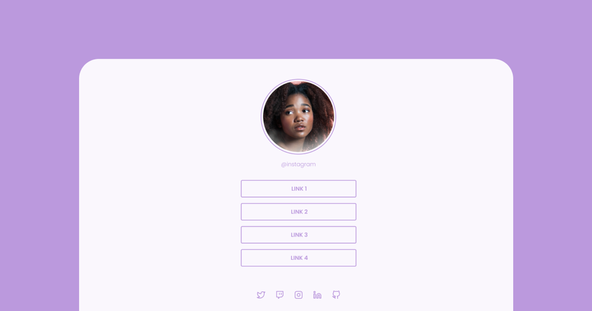

<h1 align="center"> Social Links </h1>

Desafio gratuito promovido pela Rocketseat.

  <a href="#-tecnologias">Tecnologias</a>&nbsp;&nbsp;&nbsp;|&nbsp;&nbsp;&nbsp;
  <a href="#-projeto">Projeto</a>&nbsp;&nbsp;&nbsp;|&nbsp;&nbsp;&nbsp;
  <a href="#-layout">Layout</a>&nbsp;&nbsp;&nbsp;|&nbsp;&nbsp;&nbsp;
  <a href="#memo-licença">Licença</a>

 

  

## 🚀 Tecnologias

Esse projeto foi desenvolvido com as seguintes tecnologias:

- HTML e CSS
- Git e Github
- Figma

## 💻 Projeto

Site básico para agrupamento de links.

## 🔖 Layout

Você pode visualizar o layout do projeto através [desse link](https://www.figma.com/file/JSyapkxtP5WdhQytK3u6F6/Social-Tree-%E2%80%A2-Desafio-Discover-(Community)?type=design&node-id=113-4&t=0w0uCs3MLORqMQ2b-0). É necessário ter conta no [Figma](https://figma.com) para acessá-lo.

## :memo: Licença

Esse projeto está sob a licença MIT.

---

Feito com ♥ by @igorbgoes